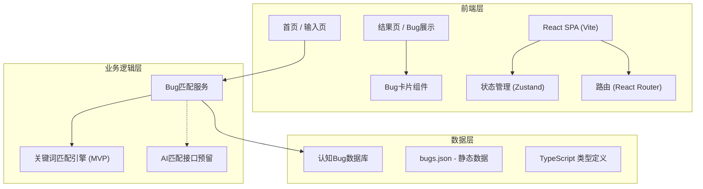

## 1. 架构设计



## 2. 技术说明

- **前端框架**：React 18 + TypeScript
- **构建工具**：Vite 5
- **样式方案**：Tailwind CSS 3
- **状态管理**：Zustand
- **路由**：React Router DOM 6
- **图标库**：Lucide React
- **后端**：无（纯前端 MVP，后续可扩展 Express 或接入 AI API）
- **数据存储**：本地 JSON 文件（`src/data/bugs.json`）

## 3. 路由定义

| 路由 | 页面 | 用途 |
|------|------|------|
| `/` | HomePage | 首页 - 展示品牌和输入框 |
| `/result` | ResultPage | 结果页 - 展示匹配到的认知 Bug 卡片 |
| `/museum` | MuseumPage | 博物馆页 - 浏览全部认知 Bug（MVP 可选） |

## 4. 数据模型

### 4.1 认知 Bug 数据结构

```typescript
interface CognitiveBug {
  id: string;                    // 唯一标识，如 "catastrophizing"
  name: string;                  // 中文名称，如 "灾难化思维"
  alias?: string[];              // 别名/其他叫法
  category: BugCategory;         // 分类
  severity: 'low' | 'medium' | 'high';  // 严重程度
  description: string;           // 简短定义
  examples: string[];            // 典型表现/想法示例
  coping: string[];              // 应对策略
  keywords: string[];            // 匹配关键词（用于 MVP 匹配）
  triggers?: string[];           // 常见触发场景
  museumNumber: string;          // 博物馆藏品编号，如 "CB-001"
}

type BugCategory = 
  | 'thinking'      // 思维偏差
  | 'emotional'     // 情绪偏差
  | 'behavioral'    // 行为偏差
  | 'social';       // 社交偏差

interface BugMatchResult {
  bug: CognitiveBug;
  matchScore: number;        // 匹配度 0-1
  matchedKeywords: string[]; // 命中的关键词
  matchReason?: string;      // 匹配原因说明（AI 扩展用）
}
```

### 4.2 Bug 匹配服务接口设计（预留 AI 扩展）

```typescript
interface BugMatcher {
  match(input: string, bugs: CognitiveBug[]): Promise<BugMatchResult[]>;
}

// MVP 实现：基于关键词匹配
class KeywordBugMatcher implements BugMatcher {
  async match(input: string, bugs: CognitiveBug[]): Promise<BugMatchResult[]> {
    // 关键词匹配逻辑
  }
}

// 未来 AI 实现
class AIBugMatcher implements BugMatcher {
  async match(input: string, bugs: CognitiveBug[]): Promise<BugMatchResult[]> {
    // 调用 LLM API 进行语义匹配
  }
}
```

## 5. 项目目录结构

```
src/
├── components/          # 可复用组件
│   ├── BugCard.tsx         # Bug 展示卡片
│   ├── BugCardDetail.tsx   # Bug 详情展开
│   ├── ThoughtInput.tsx    # 想法输入框
│   └── MuseumHeader.tsx    # 页头/品牌区
├── pages/               # 页面组件
│   ├── HomePage.tsx        # 首页
│   └── ResultPage.tsx      # 结果页
├── data/                # 数据
│   └── bugs.json           # 认知 Bug 静态数据
├── services/            # 业务服务
│   └── bugMatcher.ts       # Bug 匹配服务
├── store/               # 状态管理
│   └── useAppStore.ts      # 全局状态
├── types/               # 类型定义
│   └── bug.ts              # Bug 相关类型
├── utils/               # 工具函数
├── App.tsx
├── main.tsx
└── index.css
```
