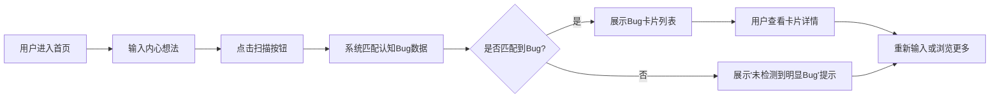

## 1. 产品概述

「认知Bug博物馆」是一个帮助用户识别自身认知偏差的交互式 Web 应用。用户输入内心想法，系统分析并展示可能存在的认知偏差（"思维Bug"），以博物馆展品卡片的形式呈现，帮助用户觉察和反思自身的思维模式。

- 目标用户：关注自我成长、心理学爱好者、有自我反思习惯的人群
- 产品价值：将抽象的认知偏差概念具象化、趣味化，降低认知门槛

## 2. 核心功能

### 2.1 功能模块
1. **首页（输入页）**：品牌展示、引导文案、想法输入框、提交按钮
2. **结果页**：匹配到的认知 Bug 卡片列表、每张卡片的详情展示、重新输入入口

### 2.2 页面详情
| 页面名称 | 模块名称 | 功能描述 |
|----------|----------|----------|
| 首页 | 品牌区 | 展示 Logo 与标语，建立"博物馆"氛围 |
| 首页 | 输入区 | 大尺寸文本输入框，支持多行输入想法，附带示例占位符 |
| 首页 | 引导区 | 展示功能说明，降低用户使用门槛 |
| 结果页 | 结果摘要 | 展示匹配到的 Bug 数量和简短总结 |
| 结果页 | Bug 卡片网格 | 以博物馆展品卡片形式展示每个认知偏差 |
| 结果页 | Bug 卡片详情 | 名称、别名、定义、表现形式、应对策略、严重程度标签 |
| 结果页 | 操作区 | 重新输入、查看全部 Bug 列表入口 |

## 3. 核心流程

用户在首页输入自己的想法 → 点击"扫描认知Bug"按钮 → 系统分析输入内容 → 跳转到结果页 → 以卡片形式展示匹配到的认知偏差 → 用户可点击卡片查看详情 → 用户可重新输入

## 4. 用户界面设计

### 4.1 设计风格
- **整体调性**：博物馆/档案馆氛围，带有一丝神秘感和学术感
- **主色**：深墨绿 `#1a3a3a`（博物馆墙面感）
- **辅色**：暖金 `#c9a962`（展品标签/强调色）、米白 `#f5f0e6`（展卡底色）
- **点缀色**：赭红 `#b4543d`（警告/严重Bug标签）
- **字体**：展示字体使用「思源宋体」或类似衬线字体（博物馆标签感），正文使用现代无衬线字体
- **卡片风格**：仿博物馆展品信息卡，带细微纹理、做旧感边框、角落装饰
- **图标风格**：线条简洁的复古风格图标
- **动效**：卡片入场使用交错淡入上浮，悬停有轻微抬升和光影变化

### 4.2 页面设计概览
| 页面名称 | 模块名称 | UI 元素 |
|----------|----------|---------|
| 首页 | 品牌区 | 衬线字体大标题、副标题、装饰性分隔线 |
| 首页 | 输入区 | 大尺寸圆角输入框（米白底）、金色提交按钮、输入时的微交互 |
| 首页 | 背景 | 深墨绿底色、细微噪点纹理、模糊光斑装饰 |
| 结果页 | 结果摘要 | 衬线字体标题、匹配数量徽章、简短引导文案 |
| 结果页 | Bug 卡片 | 米白展卡、金色标签、严重度色标、卡片编号（类似博物馆藏品编号） |
| 结果页 | 卡片详情 | 展开动画、分区展示（定义/表现/应对）、引用样式 |

### 4.3 响应式设计
- 桌面优先设计，移动端自适应
- 桌面端：卡片采用 2-3 列网格布局
- 移动端：卡片单列堆叠，输入框全宽
- 触摸交互：增大点击热区，优化移动端输入体验
